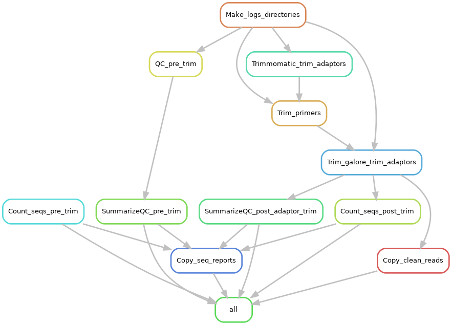

# Snakemake workflow: Run quality control on input reads
Given a set of sample forward and reverse illumina reads, trim primers and adaptors, and provide useful statistics about the reads before and after trimming. The pipeline uses a double adaptor trimming approach using trimmomatic followed by trim_galore. I found this approach useful when dealing with multiple adaptor types (illumina, Nextera, Truseq etc) in a sequence.

 

## The pipeline requires the following programs

* fastQC
* multiQC
* seqkit
* trim_galore
* cutadapt
* snakemake

Please do not forget to cite the authors of the tools used.

## The pipeline does the following

1. Quality checks the raw reads using fastQC and summarizes them with multiQC

2. Counts and generates useful statistics on the raw reads using seqkit 

3. Trims adaptors using Trimmomatic

4. Trims primers from the 5' sequence end using cutadapt

5. Further trims off adaptors that might have been skipped by trimmomatic using trim_galore. Trim galore trims the adaptors using cutadapt and reports qaulity statistics using fastQC  

6. Summarizes the quality checks of fastQC and cutadapt for the clean reads using multiQC.  

7. Counts and generates useful statistics on the clean reads using seqkit.

8. Finally copies the clean reads and statistics on the reads before and after trimming to a folder called 10.Export/ for ease of export. It is safe to delete other folders if you would like to save space and memory. 

## Authors

* Olabiyi Obayomi (@olabiyi)

Before you start, make sure you have installed the programs listed above.

## Steps

### Step 1

Install the software list above.

### Step 2 

Obtain a copy of this workflow 

	git clone https://github.com/olabiyi/snakemake-Quality-check.git

### Step 3
 
Move your raw data to the 01.raw_data directory

	# Delete anything that may be present in the raw data directory
	rm -rf  mkdir 01.raw_data/*
	# Move your read files to the rawa data directory - Every sample in its own directory - see the example in this repo
	mv  location/rawData/16S/* 01.raw_data/	

### Step 4: Configure workflow

Configure the workflow according to your needs by editing the files in the `config/config.yaml` file

	# Get a list of samples to be pasted in the config.yaml file
    # Assuming your samples are in folder called 01.raw_data/ and the folders within correspond to your sample names
    # Run the commands below to get your sample list 
	SAMPLES=($(ls -1 01.raw_data/ |sort -V))
	(echo -ne '[';echo ${SAMPLES[*]} | sed -E 's/ /, /g' | sed -E 's/(\w+)/"\1"/g'; echo -e ']') 

### Step 4:  Run the pipeline

	snakemake -pr --cores 10 --keep-going

Upon successful completion, your clean reads will be in a folder named **10.Export/** along with useful statistics before and after trimming. It is safe to delete other folders if you would like to save space and memory.

